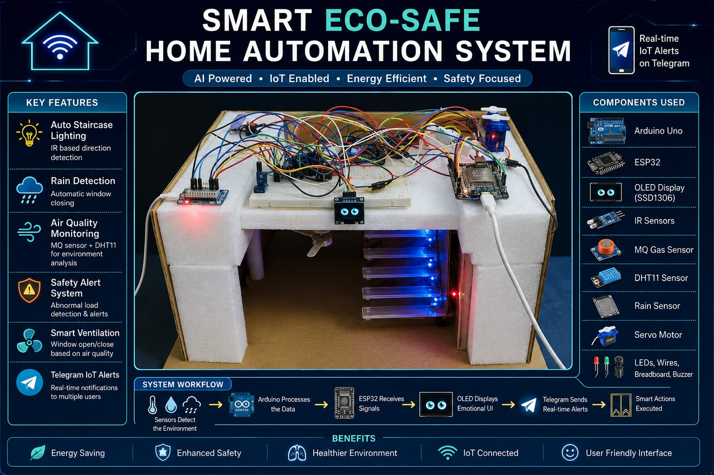
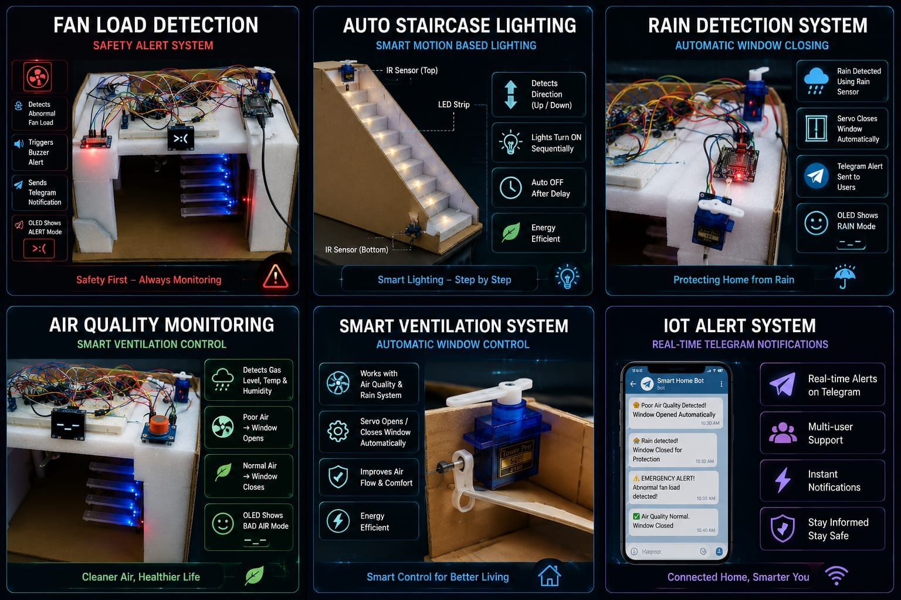

# 🏠 Smart Eco-Safe Home Automation System

An advanced IoT-based Smart Home Automation System focused on **Safety, Sustainability, Environmental Monitoring, Energy Efficiency, and Real-Time Communication**.

Unlike traditional smart home systems that only automate appliances, this project integrates environmental monitoring, emergency detection, intelligent automation, and IoT-based notifications into a single unified platform.




---

## 🚀 Project Overview

The Smart Eco-Safe Home Automation System is designed to create a safer, smarter, and more sustainable living environment.

The system continuously monitors environmental and safety conditions using sensors and automatically takes appropriate actions while notifying users through Telegram alerts and an interactive OLED interface.

---

# ✨ Key Features




## ⚠️ Anti-Suicide Fan Load Detection System

* Detects abnormal fan load conditions
* Triggers emergency buzzer alerts
* Sends real-time Telegram notifications
* Designed as a safety-awareness feature
* Provides immediate emergency indication

---

## 💡 Smart Auto Staircase Lighting

* Uses IR sensors for motion detection
* Detects movement direction
* Sequential lighting effect
* Automatic ON/OFF operation
* Energy-efficient lighting control

### Benefits

* Reduced electricity consumption
* Improved convenience
* Enhanced safety during night-time movement

---

## 🌫 Air Quality Monitoring & Smart Ventilation

### Monitors

* Air Quality
* Temperature
* Humidity

### Actions

* Detects poor indoor air conditions
* Automatically controls window ventilation
* Improves indoor environmental quality

### Components

* MQ Gas Sensor
* DHT11 Sensor
* Servo Motor

---

## 🌧 Rain Detection System

* Detects rainfall in real time
* Automatically closes windows
* Protects indoor environment from rainwater
* Sends instant Telegram alerts

---

## 🤖 Emotional OLED Interface

A unique feature of this project.

Instead of displaying only sensor data, the OLED behaves like a smart robotic assistant.

### OLED Modes

#### Normal Mode

👀 Animated Robo Eyes

💬 System Status Messages

Examples:

* System Active
* Monitoring...
* Air Quality OK
* No Rain Detected
* Energy Saving Mode

#### Alert Mode

Displays different emotions based on system events:

😡 ALERT

🌧 RAIN

😴 BAD AIR

---

## 📲 Telegram IoT Alert System

Real-time notifications are sent directly to users.

### Alerts

* Poor Air Quality Detected
* Rain Detected
* Rain Stopped
* Air Quality Normal
* Emergency Fan Load Alert

### Advantages

* Remote monitoring
* Immediate awareness
* Multi-user notification support

---

# 🔧 Hardware Components

| Component    | Purpose                           |
| ------------ | --------------------------------- |
| Arduino Uno  | Sensor Processing & Control       |
| ESP32        | WiFi & IoT Communication          |
| OLED SSD1306 | Emotional Display Interface       |
| MQ Sensor    | Air Quality Detection             |
| DHT11        | Temperature & Humidity Monitoring |
| Rain Sensor  | Rain Detection                    |
| Servo Motor  | Window Automation                 |
| IR Sensors   | Staircase Motion Detection        |
| LEDs         | Staircase Lighting                |
| Buzzer       | Emergency Alerts                  |

---

# 🧠 System Architecture

```text
Sensors
   │
   ▼
Arduino Uno
   │
   ▼
ESP32
   │
   ├── Telegram Alerts
   ├── OLED Interface
   └── Automation Decisions

```

# 🔄 Working Flow

```text
Sensor Detects Event
         │
         ▼
Arduino Processes Data
         │
         ▼
ESP32 Receives Signal
         │
         ├── OLED Reaction
         ├── Telegram Notification
         └── Automation Action

```

# 💻 Technologies Used

* Arduino IDE
* Embedded C/C++
* ESP32
* Telegram Bot API
* IoT Communication
* OLED Graphics
* Sensor Interfacing
* Automation Logic

# 🌱 Sustainability Impact

This project contributes to:

* Energy Conservation
* Smart Resource Utilization
* Indoor Environmental Monitoring
* Sustainable Living Practices

---

# 🎯 SDG Goals Supported

### SDG 3 – Good Health and Well-Being

* Air quality monitoring
* Safety awareness systems

### SDG 7 – Affordable and Clean Energy

* Smart staircase lighting
* Energy-efficient automation

### SDG 9 – Industry, Innovation and Infrastructure

* IoT-based smart automation

### SDG 11 – Sustainable Cities and Communities

* Smart home environmental monitoring

### SDG 13 – Climate Action

* Efficient resource usage
* Environmental awareness

---

# ⭐ Support

If you found this project useful:

⭐ Star this repository
